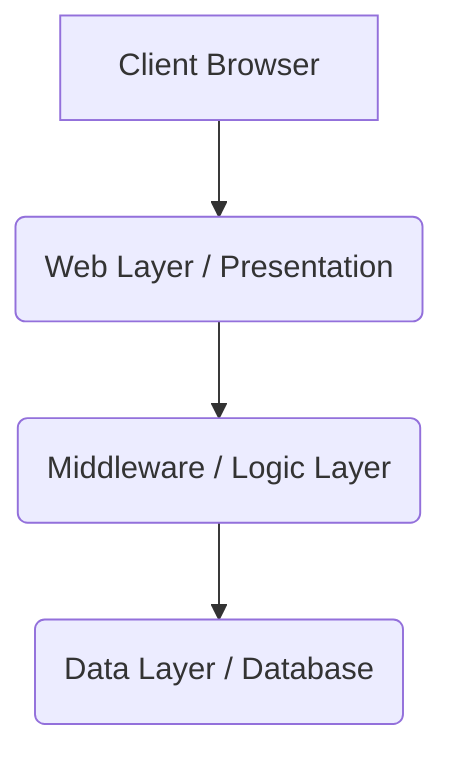

# ADR-005: Project IN Architecture Design

- **Status**: PROPOSED
- **Date**: 2025-07-31

## Context

Designing the architecture for a new project named 'IN'

## Decision

Choose between monolithic and microservices architecture

## Consequences

Monolithic: easier to develop, maintain. Microservices: better scalability, flexibility.

## Architecture Diagram

