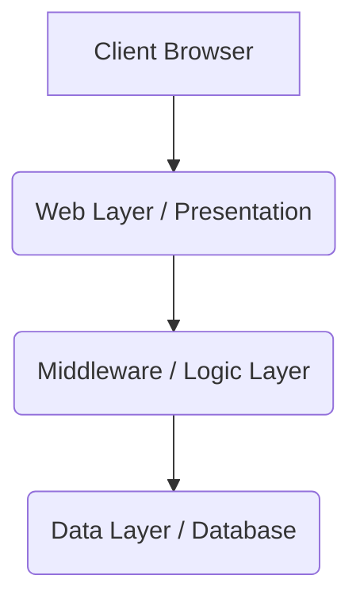

# ADR-009: Comprehensive Technical Details, Specifications, and Implementation Context

- **Status**: IN-PROGRESS
- **Date**: 2025-08-15

## Context

This ADR addresses the need for detailed technical documentation to support the development process. The context includes the requirements, constraints, and goals of the project.

## Decision

To create a comprehensive architecture design document with detailed specifications, including implementation context, to ensure clarity and consistency throughout the project.

## Consequences

The consequences include improved understanding among team members, easier tracking of architectural decisions, and better alignment with project goals. This will also help in future maintenance and scaling of the system.

## Architecture Diagram

